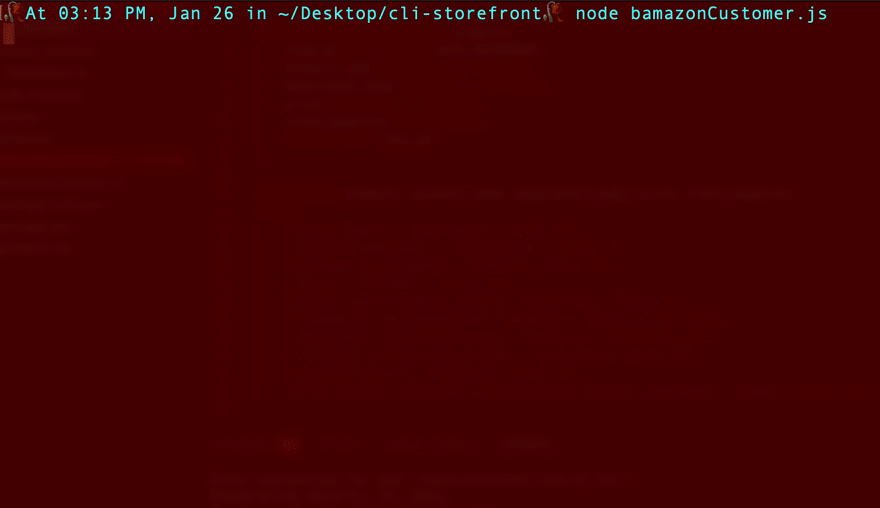

# Bamazon

## A mock-storefront CLI app built for UA Coding Bootcamp

Bamazon is a simple CLI app meant to imitate an online shopping platform.

Bamazon uses:

* The [Node.js](https://nodejs.org/en/) runtime environment.
* A [MySQL](https://www.mysql.com/) database.
* [Inquirer.js](https://www.npmjs.com/package/inquirer) to get customer responses.

### Contents:

* `custom_modules` contains one custom JavaScript module:
  * [`tableMaker.js`](custom_modules/tableMaker.js) displays the Bamazon database as a table.
* A `.gitignore`.
* [`bamazon_seed.sql`](bamazon_seed.sql) is a SQL script for initializing the Bamazon database.
* [`bamazonCustomer.js`](bamazonCustomer.js) contains the application's core functions.
* NPM's `package-lock.json` and `package.json` files.
* And this `readme`!

### Application:

The application's core functionality can be found in [`bamazonCustomer.js`](bamazonCustomer.js).

First, I load all necessary external modules on **lines 1-11**, including the custom [`tableMaker.js`](custom_modules/tableMaker.js) module.

On **lines 13-32**, I define two validation functions that will later be called within inquirer prompts. `isValidId` checks IDs against a supplied array of possible valid IDS while `isValidQuantity` checks for integer quantities greater than 0. I chose to define my validation functions in advance to reduce nesting and improve readability.

Finally, I define the core app functions on **lines 34-124**:

* On **lines 36-40**, I establish a connection to the bamazon database then call the `accessStore` function.
* On **lines 42-51**, I define the `accessStore` function, which queries the database for all relevant information then calls the `askPurchase` function on the result.
* On **lines 52-75**, I define the `askPurchase` function, which prompts the user for an item ID and quantity to purchase (and calls the validation functions on each) then calls `makePurchase` on the result.
* On **lines 76-101**, I define the `makePurchase` function, which filters the ordered item from the database data, queries the database to determine the quantity available, and makes the purchase if there's sufficient stock or alerts the customer if there isn't. After the purchase is made, I call the `restart` function.
* On **lines 102-123**, I define the restart function, which removes any items with a quantity of 0 from the database then presents the customer with the option of making another purchase and closes the connection if they decline.

### Bamazon in action:

